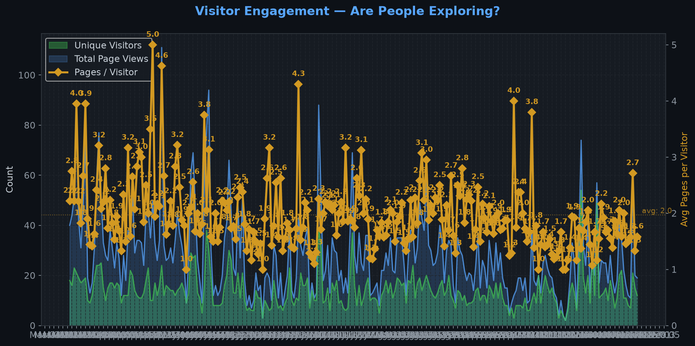
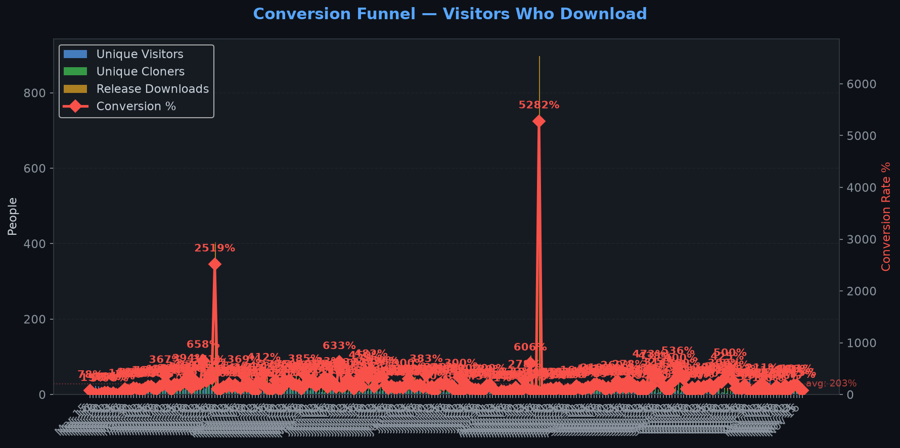
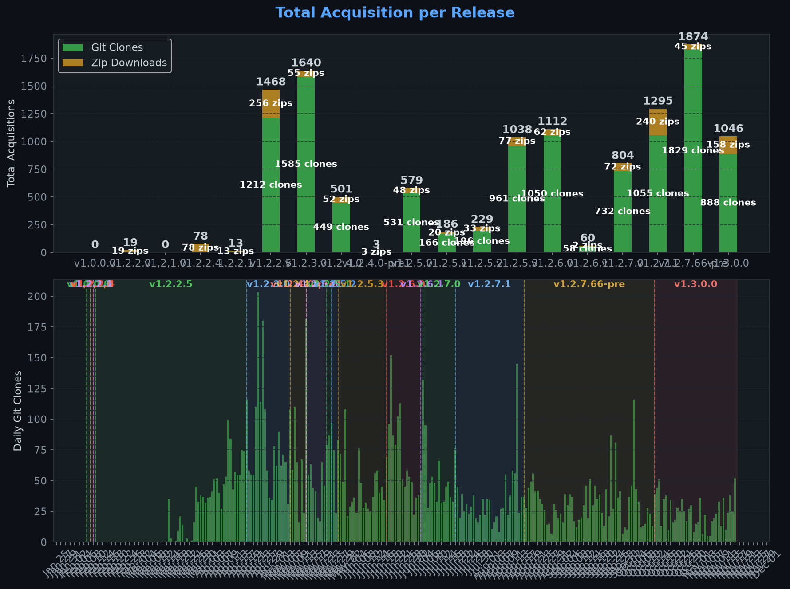

# Repository Traffic Dashboard

**Last updated:** 2026-11-22T18:05:25Z
**Days tracked:** 192 | **Download snapshots:** 954 (hourly)

---

## Views & Clones (14-day window, preserved forever)

| Metric | 14-Day Total | Unique |
|--------|-------------|--------|
| Page Views | 338 | 153 |
| Git Clones | 451 | 153 |

> **Engagement:** 2.2 pages per visitor (14-day avg)

---

## Visitor Engagement

> Higher = visitors exploring more pages. 1.0 = bounce. 3.0+ = deeply engaged.

---

## Conversion Funnel

> **14-day conversion:** 1396 of 153 visitors cloned or downloaded (**912.4%**)
>
> Unique cloners: 153 | Release downloads: 1243

---

## Total Acquisition per Release (Downloads + Clones)

| Channel | Count |
|---------|-------|
| Zip Downloads | 1243 |
| Git Clones (14-day) | 451 |
| **Total Acquisitions** | **1694** |

---

## Referrers

| Source | Views | Unique |
|--------|-------|--------|
| github.com | 107 | 39 |
| Google | 53 | 49 |
| kingmods.net | 12 | 5 |
| Bing | 6 | 5 |
| yandex.ru | 3 | 2 |
| realisticfarming.com | 2 | 2 |
| DuckDuckGo | 2 | 1 |
| Yahoo | 1 | 1 |

---

## Repository Growth

| Metric | Current |
|--------|---------|
| Stars | 37 |
| Forks | 4 |
| Watchers | 4 |

---

## Top Pages (14-day)

| Page | Views | Unique |
|------|-------|--------|
| `/Realistic-Farming/FS25_NPCFavor` | 240 | 133 |
| `/Realistic-Farming/FS25_NPCFavor/releases/tag/v1.3.0.0` | 26 | 23 |
| `/Realistic-Farming/FS25_NPCFavor/releases` | 15 | 11 |
| `/Realistic-Farming/FS25_NPCFavor/issues` | 10 | 8 |
| `/Realistic-Farming/FS25_NPCFavor/wiki` | 5 | 4 |
| `/Realistic-Farming/FS25_NPCFavor/blob/main/docs/README.md` | 5 | 1 |
| `/Realistic-Farming/FS25_NPCFavor/blob/main/main.lua` | 4 | 4 |
| `/Realistic-Farming/FS25_NPCFavor/blob/main/README.md` | 3 | 3 |
| `/Realistic-Farming/FS25_NPCFavor/pulls` | 3 | 2 |
| `/Realistic-Farming/FS25_NPCFavor/tree/main` | 3 | 2 |

---

## Data Files

| File | Description | Granularity |
|------|-------------|-------------|
| [daily.json](daily.json) | Views & clones per day (never expires) | Daily |
| [downloads.json](downloads.json) | Release download snapshots | Hourly |
| [referrers.json](referrers.json) | Referrer snapshots | Daily |
| [metadata.json](metadata.json) | Stars, forks, watchers | Daily |
| [stats.json](stats.json) | Combined legacy snapshots | 6-hourly |

---
*Hourly download tracking + full dashboard with engagement metrics every 6 hours*
*Auto-generated by [traffic-stats.yml](../../.github/workflows/traffic-stats.yml)*
